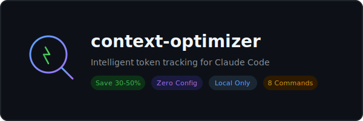
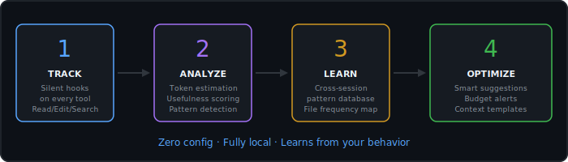
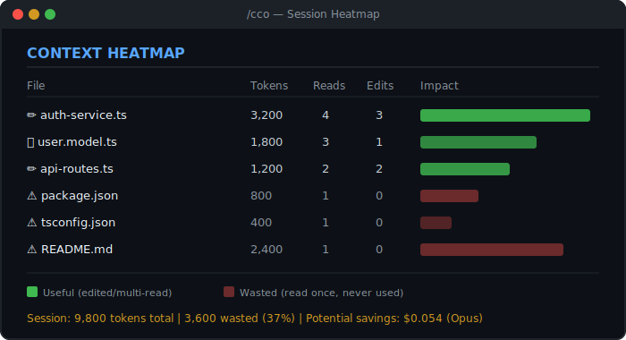
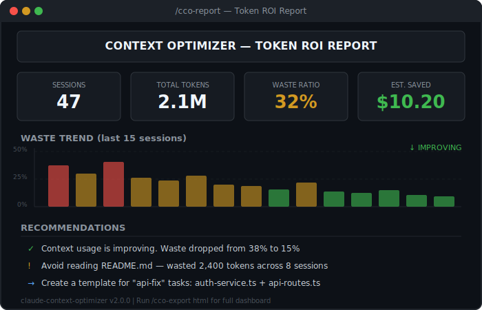
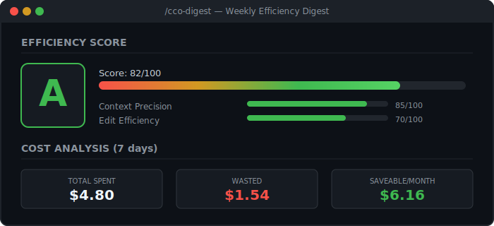

<p align="center">
  
</p>

<p align="center">
  <strong>Stop burning tokens on files Claude never uses.</strong>
</p>

<p align="center">
  <a href="#installation"></a>
  <a href="LICENSE"></a>
  
  
  
</p>

---

## The Problem

The average Claude Code session **wastes 30-50% of tokens** on files that are read but never actually used. Every `Read` call consumes context — whether the file was relevant or not.

- A 200-line config file? **800 tokens gone.**
- A README you glanced at once? **2,400 tokens burned.**
- That `package.json` Claude reads "just in case"? **120 tokens, every time.**

At $15/M tokens (Opus), a developer spending $100/month is lighting **$30-50 on fire** on irrelevant context.

## The Solution

**context-optimizer** silently tracks every file read, edit, and search. It learns which files are actually useful and which are waste. Over time, it builds a profile of your coding patterns and tells you exactly where your tokens go — and how to stop wasting them.

<p align="center">
  
</p>

---

## Features

### Context Heatmap — see where your tokens go

Run `/cco` to get a visual breakdown of every file in your session. Green = useful. Red = waste.

<p align="center">
  
</p>

### Token ROI Report — full analytics across sessions

Run `/cco-report` for a comprehensive dashboard: total tokens, waste ratio, cost estimates, trends, and actionable recommendations.

<p align="center">
  
</p>

### Efficiency Score — gamified optimization

Run `/cco-digest` for a weekly efficiency grade (S/A/B/C/D/F) with breakdown by precision, edit ratio, search accuracy, and focus.

<p align="center">
  
</p>

### Token Budget — never overspend

Set a token budget and get real-time warnings as you approach the limit. Automatic alerts at 50%, 70%, 85%, 95% with cost estimates.

```
[context-budget] 70% of token budget used (~70K/100K) | Est. cost: $1.050 (opus)
[context-budget] 90% of token budget used (~90K/100K) | Consider running /compact to free context
```

### Git-Aware Suggestions — smart context loading

Run `/cco-git` and the plugin analyzes your `git diff`, finds related test files, configs, and historically useful files — then suggests exactly what to load.

### Context Templates — presets for common tasks

Create reusable context sets for different task types:

```bash
/cco-templates create bug-fix    # Save files you always need for bug fixes
/cco-templates apply bug-fix     # Load them instantly next time
```

### Smart Loader Skill — automatic suggestions

The plugin learns from your behavior. When you start a new task, it silently suggests files you'll probably need based on historical patterns. No configuration required.

### HTML Export — shareable dashboards

Run `/cco-export html` to generate a beautiful dark-themed dashboard you can open in any browser or share with your team.

---

## All Commands

| Command | Description |
|---------|-------------|
| `/cco` | Session heatmap — visual file-by-file token breakdown |
| `/cco-report` | Full ROI report — stats, trends, waste analysis, recommendations |
| `/cco-digest [days]` | Efficiency digest — score, grade, cost analysis (default: 7 days) |
| `/cco-budget [status\|set\|model]` | Token budget — configure limits and cost model |
| `/cco-git` | Git-aware suggestions — smart file loading based on diff |
| `/cco-templates [list\|create\|apply\|delete]` | Context templates — reusable file sets for task types |
| `/cco-export [md\|html]` | Export reports — Markdown or HTML dashboard |
| `/cco-clean` | Cleanup — remove old tracking data |

---

## Installation

### Option 1 — Load directly (recommended)

Clone the repo anywhere and point Claude Code at it:

```bash
git clone https://github.com/egorfedorov/claude-context-optimizer.git ~/claude-context-optimizer
claude --plugin-dir ~/claude-context-optimizer
```

This loads the plugin for the current session. To make it persistent, add it to your settings:

**In `~/.claude/settings.json`:**
```json
{
  "plugins": [
    "~/claude-context-optimizer"
  ]
}
```

### Option 2 — GitHub marketplace (team distribution)

Add the repo as a custom marketplace in `~/.claude/settings.json`:

```json
{
  "extraKnownMarketplaces": {
    "egorfedorov-plugins": {
      "source": {
        "source": "github",
        "repo": "egorfedorov/claude-context-optimizer"
      }
    }
  }
}
```

Then install via:
```
/plugin → Discover → claude-context-optimizer → Install
```

### Requirements

- Node.js >= 18
- Claude Code (with plugin support)

---

## How It Works

```
You use Claude Code normally
         │
         ▼
┌─────────────────────┐
│  PostToolUse Hook    │  Silent. Runs on every Read/Edit/Write/Glob/Grep/Agent.
│  tracker.js          │  Records: file path, line count, token estimate, timestamp.
└─────────┬───────────┘
          │
          ▼
┌─────────────────────┐
│  Session Store       │  ~/.claude-context-optimizer/sessions/<id>.json
│  Per-file tracking   │  Reads, edits, usefulness score, token estimate.
└─────────┬───────────┘
          │
          ▼
┌─────────────────────┐
│  SessionEnd Hook     │  Finalizes session. Computes waste. Updates patterns DB.
│  Pattern Learning    │  Tracks which files are consistently useful/wasted.
└─────────┬───────────┘
          │
          ▼
┌─────────────────────┐
│  Reports & Insights  │  /cco, /cco-report, /cco-digest
│  Budget Alerts       │  Real-time warnings when approaching token limits.
│  Smart Suggestions   │  File recommendations based on git state + history.
└─────────────────────┘
```

### What counts as "useful"?

A file is considered **useful** if:
- It was **edited** after being read (high value — you needed it to make changes)
- It was **read multiple times** (you kept referring back to it)

A file is considered **wasted** if:
- It was **read once and never referenced again**
- It was never edited or re-read during the session

### Token estimation

Tokens are estimated at ~4 tokens per line (industry average for code). This is a rough estimate — actual usage depends on content density — but it's consistent enough for comparative analysis.

---

## Data Storage

```
~/.claude-context-optimizer/
├── sessions/           # Per-session tracking data (JSON)
├── budget/             # Per-session budget state
├── templates/          # User-defined context templates
├── exports/            # Exported reports (MD/HTML)
├── config.json         # Budget and preference settings
├── patterns.json       # Cross-session file usage patterns
└── global-stats.json   # Aggregate statistics
```

---

## Plugin Structure

```
claude-context-optimizer/
├── .claude-plugin/
│   └── plugin.json          # Plugin manifest
├── src/
│   ├── tracker.js           # Core: file & token tracking engine
│   ├── budget.js            # Token budget monitor with alerts
│   ├── digest.js            # Efficiency score & weekly digest
│   ├── git-context.js       # Git-aware context suggestions
│   ├── report.js            # ROI report generator
│   └── export.js            # MD/HTML report exporter
├── commands/
│   ├── cco.md               # /cco — session heatmap
│   ├── cco-report.md        # /cco-report — full ROI report
│   ├── cco-digest.md        # /cco-digest — efficiency digest
│   ├── cco-budget.md        # /cco-budget — budget manager
│   ├── cco-git.md           # /cco-git — git suggestions
│   ├── cco-export.md        # /cco-export — report export
│   ├── cco-templates.md     # /cco-templates — template manager
│   └── cco-clean.md         # /cco-clean — data cleanup
├── agents/
│   └── context-analyzer.md  # Deep analysis agent
├── skills/
│   └── smart-loader/
│       └── SKILL.md         # Auto-suggestion skill
├── hooks/
│   └── hooks.json           # Hook configuration
├── assets/                  # SVG visuals for README
└── package.json
```

---

## Privacy

This plugin:

- **Tracks only file paths and line counts** — never file contents
- **Stores everything locally** in `~/.claude-context-optimizer/`
- **Sends zero telemetry** — no network calls, no analytics, no tracking
- **Can be fully wiped** with `/cco-clean --reset-all`

Your data never leaves your machine. Period.

---

## FAQ

**Q: Does this slow down Claude Code?**
A: No. Hook scripts run asynchronously and typically complete in <10ms. The tracker only writes small JSON files.

**Q: How accurate are the token estimates?**
A: They use a ~4 tokens/line heuristic. It's not exact, but it's consistent across sessions, making trends and comparisons reliable.

**Q: Can I use this with Claude Sonnet / Haiku?**
A: Yes. Set your model with `/cco-budget model sonnet` for accurate cost estimates.

**Q: Will this work with subagents?**
A: Yes. The PostToolUse hook fires for all tool calls, including those made by subagents.

---

## Contributing

PRs welcome. Areas that need help:

- [ ] More accurate token counting (AST-based instead of line-based)
- [ ] VSCode extension for visual heatmap overlay
- [ ] Team sharing — aggregate patterns across team members
- [ ] Auto-compact trigger based on budget thresholds
- [ ] Integration with Claude Code's built-in `/cost` command

---

## License

MIT — do whatever you want with it.

---

<p align="center">
  <sub>Built with frustration at wasted tokens and love for efficiency.</sub>
</p>
